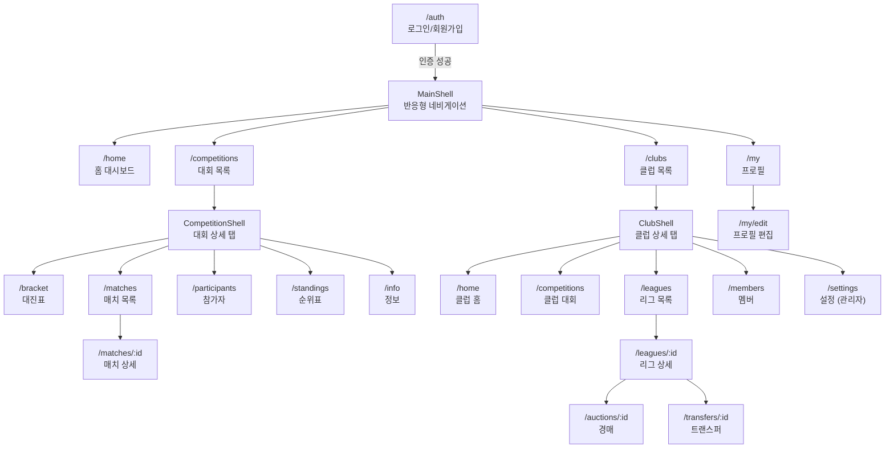

# Final Whistle - 앱 디자인 가이드

## 1. 앱 목적

**Final Whistle**은 축구/풋살 e스포츠 토너먼트와 판타지 리그를 운영하는 플랫폼이다.

### 핵심 가치
- 클럽 단위로 대회를 생성하고 관리
- 다양한 대진표 형식(싱글엘리미네이션, 리그 등) 지원
- 판타지 리그: 경매, 트레이드, FA 입찰
- 실시간 매치 결과 기록 및 순위 추적

### 대상 사용자
- **일반 유저**: 클럽 가입, 대회 참가, 매치 결과 확인
- **클럽 관리자**: 클럽 운영, 대회 생성, 멤버 관리
- **리그 커미셔너**: 판타지 리그 진행, 경매 운영

---

## 2. 주요 기능

| 기능 | 설명 |
|------|------|
| **인증** | 이메일 기반 로그인/회원가입 (Supabase Auth) |
| **홈 대시보드** | 참가 중인 대회, 클럽 소식 요약 |
| **대회 관리** | 대회 생성, 대진표, 매치, 순위표, 참가자 관리 |
| **클럽 관리** | 클럽 생성/가입, 멤버 역할 관리, 초대 코드 |
| **판타지 리그** | 리그 생성, 상태 관리 (Draft → Auction → InSeason → Playoff → Completed) |
| **경매** | 실시간 선수 경매, 입찰 |
| **트랜스퍼** | 선수 방출, 트레이드, FA 입찰 (FAAB) |
| **매치** | 결과 입력, 확인, 이의 제기 워크플로우 |
| **프로필** | 사용자 정보 편집, 로그아웃 |

---

## 3. 스타일

### 3.1 색상 팔레트

| 토큰 | 값 | 용도 |
|------|----|------|
| Primary | `#6C63FF` | 브랜드 퍼플, 주요 액션 |
| Background | `#121220` | 스캐폴드 배경 |
| Surface | `#2A2A3E` | 카드, 컨테이너 배경 |
| AppBar | `#1E1E2E` | 앱바, 네비게이션 배경 |
| Border | `#3A3A52` | 카드 테두리, 구분선 |
| Success | Green | 활성/완료 상태 |
| Error | Material Red | 오류, 삭제 |
| Warning | Orange | 진행 중 상태 |

> 다크 모드 전용. 라이트 모드 없음. `ColorScheme.fromSeed(seedColor: #6C63FF, brightness: Brightness.dark)` 기반.

### 3.2 타이포그래피

| 용도 | 스타일 | Weight |
|------|--------|--------|
| 화면 제목 | headlineSmall / headlineMedium | W600–W800 |
| 섹션 헤더 | titleSmall / titleMedium | W600 |
| 본문 | bodySmall / bodyMedium | Regular |
| 라벨/태그 | labelSmall / labelMedium | W600 |

섹션 헤더는 `toUpperCase()` + `letterSpacing: 0.5` 적용.

### 3.3 간격 (4px 그리드)

| 토큰 | 값 | 용도 |
|------|----|------|
| Small | 8px | 아이콘-텍스트 간격, 리스트 수직 |
| Standard | 16px | 카드 패딩, 리스트 수평 |
| Medium | 20px | 카드 내부 패딩 |
| Large | 24–32px | 섹션 간 간격 |

### 3.4 모서리 (Border Radius)

| 토큰 | 값 | 용도 |
|------|----|------|
| Small | 10px | 버튼 |
| Standard | 14px | 카드, 입력 필드 |
| Large | 16px | 그래디언트 카드 |
| Circle | 50% | 아바타 |

### 3.5 엘리베이션 & 그림자

- 카드: **elevation 0**, 테두리(Border)로 구분
- 라이브 인디케이터만 `boxShadow(color.alpha(0.6), blur: 6)` 적용
- 플랫 디자인 지향 — 드롭 섀도우 없음

### 3.6 상태 표현

**상태 도트** (8x8 원형):
- 녹색 + glow: 활성/라이브
- 주황: 진행 중
- 회색: 대기
- 빨강: 오류

**상태 뱃지**:
```
배경: statusColor.withAlpha(0.15)
테두리: statusColor.withAlpha(0.5)
텍스트: statusColor, fontWeight: W600
borderRadius: 12px
padding: horizontal 10, vertical 4
```

### 3.7 반응형 레이아웃

| 구간 | 너비 | 네비게이션 |
|------|------|------------|
| Mobile | < 600px | BottomNavigationBar |
| Tablet | 600–1200px | NavigationRail (labelType: all) |
| Desktop | > 1200px | NavigationDrawer |

콘텐츠 최대 너비: 800–1200px (`ConstrainedBox`)

---

## 4. 컴포넌트 패턴

### 4.1 카드 컨테이너
```
Card (elevation: 0, border: #3A3A52)
  └─ InkWell (borderRadius: 14)
       └─ Padding (16)
            └─ Content
```

### 4.2 그래디언트 카드 (하이라이트용)
```
Container
  gradient: LinearGradient([primary.alpha(0.25), surface])
  border: primary.alpha(0.3)
  borderRadius: 16
```

### 4.3 다이얼로그
- AlertDialog 기반
- 폼 검증은 FormState 사용
- 입력 필드: OutlineInputBorder + custom fillColor

### 4.4 로딩/에러/빈 상태
- **로딩**: Center + CircularProgressIndicator
- **에러**: Center + cloud_off 아이콘 + 메시지 + 재시도 버튼
- **빈 상태**: Center + 관련 아이콘 + 설명 텍스트

---

## 5. 스크린별 기능 정의

### 5.1 인증 (AuthScreen)

- **User**: 미인증 사용자
- **Purpose**: 로그인 또는 회원가입하여 서비스 접근
- **Data**: 이메일, 비밀번호 입력 폼
- **Actions**: 로그인 탭, 회원가입 탭, 제출 버튼
- **Constraints**: 다크 카드 + 탭 인터페이스, 스타디움 보더 스타일링. 오류 발생 시 액션 버튼 포함 에러 메시지 표시

### 5.2 홈 (HomeScreen)

- **User**: 인증된 모든 사용자
- **Purpose**: 현재 활동 요약 확인 및 빠른 이동
- **Data**: 환영 카드(사용자 이메일), 참가 중 대회 목록(상태 인디케이터), 클럽 소식
- **Actions**: "대회 보기", "클럽 보기" 퀵 액션 카드 탭
- **Constraints**: 그래디언트 환영 카드, 인라인 디바이더, 상태 칩. 스크롤 가능한 단일 컬럼 레이아웃

### 5.3 대회 목록 (CompetitionListScreen)

- **User**: 인증된 모든 사용자
- **Purpose**: 대회 탐색, 필터링, 새 대회 생성
- **Data**: 대회 카드 리스트 (이름, 상태, 참가자 수, 날짜)
- **Actions**: FAB "대회 만들기", 필터 칩 (전체/모집중/진행중/완료), 카드 탭 → 상세
- **Constraints**: 필터 칩은 수평 스크롤. 생성 다이얼로그에 이름 입력 + 최대 참가자 슬라이더

### 5.4 대회 상세 — 대진표 탭 (CompetitionBracketTabScreen)

- **User**: 대회 참가자 및 관리자
- **Purpose**: 토너먼트 대진표 시각화 확인
- **Data**: 스테이지별 대진표 트리 구조
- **Actions**: 스테이지 선택 드롭다운 (복수 스테이지 시)
- **Constraints**: 대진표는 수평 스크롤 가능한 트리 뷰. 매치 카드 탭 시 매치 상세로 이동

### 5.5 대회 상세 — 매치 탭 (CompetitionMatchesTabScreen)

- **User**: 대회 참가자 및 관리자
- **Purpose**: 대회 내 모든 매치 목록 확인
- **Data**: 매치 리스트 (참가자, 점수, 상태)
- **Actions**: 매치 카드 탭 → 매치 상세 화면 이동
- **Constraints**: 상태별 색상 구분

### 5.6 대회 상세 — 순위표 탭 (CompetitionStandingsTabScreen)

- **User**: 대회 참가자 및 관리자
- **Purpose**: 스테이지별 순위/리더보드 확인
- **Data**: 참가자 순위 테이블 (승/무/패, 득점 등)
- **Actions**: 스테이지 선택 드롭다운
- **Constraints**: 대회 형식에 따라 순위표 레이아웃 변경

### 5.7 대회 상세 — 참가자 탭 (ParticipantListScreen)

- **User**: 대회 참가자 및 관리자
- **Purpose**: 참가자 목록 확인 및 관리
- **Data**: 참가자 리스트 (이름, 상태)
- **Actions**: [관리자] 클럽 멤버 추가, 봇 추가, 참가자 제거
- **Constraints**: 관리자만 추가/제거 액션 노출

### 5.8 대회 상세 — 정보 탭 (CompetitionInfoScreen)

- **User**: 대회 참가자 및 관리자
- **Purpose**: 대회 메타데이터 및 설정 확인
- **Data**: 대회 이름, 형식, 상태, 생성일 등
- **Actions**: [관리자] 대회 설정 변경
- **Constraints**: 읽기 전용 정보 + 관리자 전용 설정 영역 분리

### 5.9 클럽 목록 (ClubListScreen)

- **User**: 인증된 모든 사용자
- **Purpose**: 가입한 클럽 확인, 새 클럽 탐색/생성/가입
- **Data**: 클럽 카드 리스트 (아바타, 이름)
- **Actions**: 메뉴 — 공개 클럽 검색, 초대 코드 가입, 클럽 만들기
- **Constraints**: 빈 상태 시 액션 버튼 표시. 생성 다이얼로그에 이름, 설명, 공개 여부 토글

### 5.10 클럽 가입 (ClubJoinScreen)

- **User**: 비멤버 사용자
- **Purpose**: 클럽 정보 확인 후 가입
- **Data**: 클럽 아바타(이니셜), 이름, 설명, 멤버 수
- **Actions**: [공개] 바로 가입 버튼, [비공개] 초대 코드 입력 필드
- **Constraints**: primaryContainer 배경. 아바타는 이니셜 원형

### 5.11 클럽 상세 — 홈 (ClubHomeScreen)

- **User**: 클럽 멤버
- **Purpose**: 클럽 개요 확인
- **Data**: 클럽 아바타, 이름, 설명, 멤버 수
- **Actions**: 뒤로가기 → 클럽 목록
- **Constraints**: 정보 카드 중심 레이아웃

### 5.12 클럽 상세 — 대회 (ClubCompetitionsScreen)

- **User**: 클럽 멤버
- **Purpose**: 클럽 소속 대회 목록 확인
- **Data**: 대회 리스트
- **Actions**: 대회 카드 탭 → 대회 상세
- **Constraints**: 빈 상태 아이콘 + 메시지

### 5.13 클럽 상세 — 리그 (ClubLeaguesScreen)

- **User**: 클럽 멤버, 관리자
- **Purpose**: 판타지 리그 목록 확인 및 생성
- **Data**: 리그 리스트
- **Actions**: [권한 있는 사용자] FAB "리그 만들기", 리그 카드 탭 → 상세
- **Constraints**: 빈 상태 아이콘 + 메시지. 생성 다이얼로그

### 5.14 클럽 상세 — 멤버 (ClubMembersScreen)

- **User**: 클럽 멤버
- **Purpose**: 멤버 목록 확인, 역할 관리
- **Data**: 멤버 리스트 (이름, 역할: owner/admin/member)
- **Actions**: 클럽 탈퇴 확인 다이얼로그, [관리자] 멤버 관리 옵션
- **Constraints**: 역할 뱃지로 구분

### 5.15 클럽 상세 — 설정 (ClubSettingsScreen)

- **User**: 클럽 관리자만
- **Purpose**: 클럽 설정 관리
- **Data**: 초대 코드, 클럽 설정 항목
- **Actions**: 초대 코드 관리, 설정 변경
- **Constraints**: 관리자 전용 탭 (일반 멤버에게 탭 자체 숨김)

### 5.16 리그 상세 (LeagueDetailScreen)

- **User**: 리그 참가자, 커미셔너
- **Purpose**: 리그 현황 확인 및 상태 진행
- **Data**: 리그 메타데이터, 탭 (Overview / Players)
- **Actions**: [커미셔너] 상태 전환 버튼 (Draft → Auction → InSeason → Playoff → Completed)
- **Constraints**: 상태 전환은 순차적으로만 가능

### 5.17 경매 (AuctionScreen)

- **User**: 리그 참가자
- **Purpose**: 실시간 선수 경매 참여
- **Data**: 경매 보드 (선수 목록), 상태 뱃지 (Pending/LIVE/Completed)
- **Actions**: 입찰 제출, 실시간 상태 업데이트 확인
- **Constraints**: AppBar에 라이브 상태 뱃지. LIVE 상태에서 glow 이펙트. 실시간 업데이트 반영

### 5.18 트랜스퍼 (TransferScreen)

- **User**: 리그 참가자
- **Purpose**: 선수 이적 시장 운영
- **Data**: 3개 탭 콘텐츠
- **Actions**:
  - **방출 탭**: 보유 선수를 시장에 방출
  - **트레이드 탭**: 다른 팀과 선수 교환 제안/수락
  - **FA 입찰 탭**: 자유계약 선수에 FAAB 예산으로 입찰
- **Constraints**: 3탭 구조, 각 탭 독립적 폼 제출

### 5.19 매치 상세 (MatchDetailScreen)

- **User**: 매치 참가자, 대회 관리자
- **Purpose**: 매치 결과 입력 및 확인
- **Data**: 참가자 정보, 점수, 매치 상태 (Pending/InProgress/Completed/Disputed)
- **Actions**: 결과 제출, 결과 확인, 이의 제기, [관리자] 초기화
- **Constraints**: 결과 확인 워크플로우 — 양측 확인 필요. 상태별 가능한 액션 다름

### 5.20 프로필 (MyScreen)

- **User**: 인증된 사용자
- **Purpose**: 개인 정보 확인 및 계정 관리
- **Data**: 사용자 아바타, 프로필 카드
- **Actions**: 프로필 편집, 알림(비활성), 로그아웃
- **Constraints**: primaryContainer 배경 프로필 카드. 앱 버전 표시

### 5.21 프로필 편집 (EditProfileScreen)

- **User**: 인증된 사용자
- **Purpose**: 사용자 정보 수정
- **Data**: 폼 — 사용자명, 표시명, 자기소개
- **Actions**: 저장, 취소
- **Constraints**: 폼 검증 적용

---

## 6. 네비게이션 구조



### 인증 흐름
- 세션 없음 → `/auth`로 리다이렉트
- `/auth`에서 세션 있음 → `/`로 리다이렉트

### Shell 구조
- **MainShell**: 4개 메인 탭 (홈, 대회, 클럽, MY)
- **CompetitionShell**: 5개 탭 (대진표, 매치, 참가자, 순위, 정보)
- **ClubShell**: 5개 탭 (홈, 대회, 리그, 멤버, 설정) — 설정은 관리자만

---

## 7. 디자인 원칙 요약

1. **다크 모드 퍼스트** — 배경 `#121220`, 카드 `#2A2A3E`, 테두리로 구분
2. **플랫 디자인** — elevation 0, 그림자 대신 Border 사용
3. **상태 색상 일관성** — 녹색(활성), 주황(진행), 회색(대기), 빨강(오류)
4. **반응형 3단계** — Mobile(Bottom) / Tablet(Rail) / Desktop(Drawer)
5. **Material 3** — `useMaterial3: true`, `ColorScheme.fromSeed` 기반
6. **명확한 빈 상태** — 모든 리스트에 아이콘 + 메시지 + 액션 버튼
7. **관리자 UI 분리** — 권한 기반으로 액션/탭 표시/숨김
